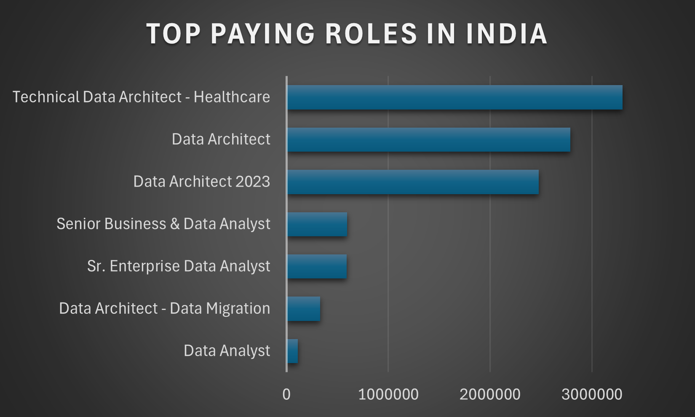
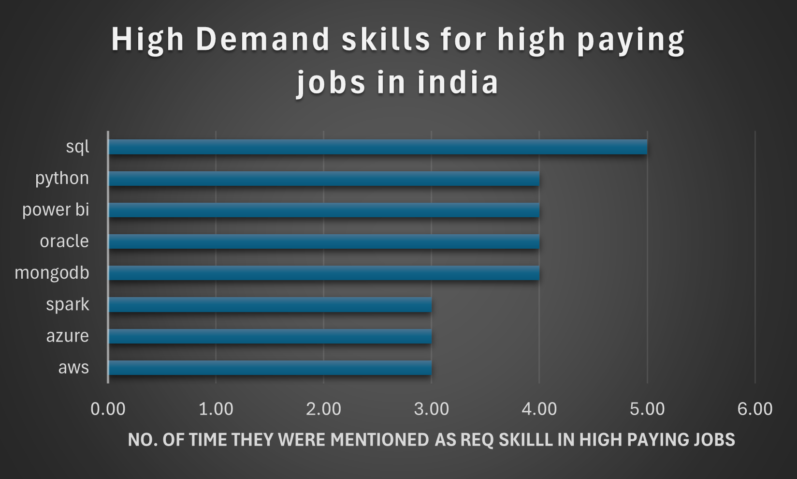

# Introduction
📊 Dive into the data job market! Focusing on data analyst roles, this project explores 💰 top-paying jobs, 🔥 in-demand skills, and 📈 where high demand meets high salary in data analytics in India.

🔍 SQL queries? Check them out here: [sql_project folder](/sql_project/)

# Background
Driven by a quest to navigate the data analyst job market more effectively, this project was born from a desire to pinpoint top-paid and in-demand skills, streamlining others work to find optimal jobs.

Data hails from my [SQL Course](https://lukebarousse.com/sql). It's packed with insights on job titles, salaries, locations, and essential skills.

### The questions I wanted to answer through my SQL queries were:

1. What are the top-paying data analyst jobs in India?
2. What skills are required for these top-paying jobs?
3. What skills are most in demand for data analysts in India?
4. Which skills are associated with higher salaries?
5. What are the most optimal skills to learn (Which are not only high paying but also more in demand)?

# Tools I Used
For my deep dive into the data analyst job market, I harnessed the power of several key tools:

- **SQL:** The backbone of my analysis, allowing me to query the database and unearth critical insights.
- **PostgreSQL:** The chosen database management system, ideal for handling the job posting data.
- **Visual Studio Code:** My go-to for database management and executing SQL queries.
- **Git & GitHub:** Essential for version control and sharing my SQL scripts and analysis, ensuring collaboration and project tracking.

# The Analysis
Each query for this project aimed at investigating specific aspects of the data analyst job market. Here’s how I approached each question:

### 1. Top Paying Data Analyst Jobs in India
To identify the highest-paying roles, I filtered data analyst positions by average yearly salary and location, focusing on remote jobs. This query highlights the high paying opportunities in the field.

```sql
SELECT 
      job_id,
      job_title,
      job_location,
      job_schedule_type,
      salary_year_avg,
      job_posted_date,
      name as company_name
FROM  job_postings_fact j 
left JOIN company_dim c on j.company_id=c.company_id
WHERE 
       job_title_short='Data Analyst' AND
       job_location like '%India' AND
       salary_year_avg IS NOT NULL
ORDER BY
       salary_year_avg DESC
LIMIT 10;
```
Here's the breakdown of the top data analyst jobs in 2023:
- **Wide Salary Range:** Top 10 paying data analyst roles span from $177,283 to $111,175 indicating significant salary potential in the field.
- **Diverse Employers:** Companies like ServiceNow, Bosch Group, and Srijan Technologies are among those offering high salaries, showing a broad interest across different industries.
- **Job Title Variety:** There's a high diversity in job titles, from Data Analyst to Director of Analytics, reflecting varied roles and specializations within data analytics.


*Bar graph visualizing the salary for the top 10 salaries for data analysts; I visualized this graph using excel and the table i got after querry*

### 2. Skills for Top Paying Jobs in India
To understand what skills are required for the top-paying jobs, I joined the job postings with the skills data, providing insights into what employers value for high-compensation roles.
```sql
WITH top_paying_jobs AS(
        SELECT 
            job_id,
            job_title,
            job_location,
            salary_year_avg,
            name as company_name
        FROM  job_postings_fact j 
        left JOIN company_dim c on j.company_id=c.company_id
        WHERE 
            job_title_short='Data Analyst' AND
            job_location like '%India' AND
            salary_year_avg IS NOT NULL
        ORDER BY
            salary_year_avg DESC
        LIMIT 10)

SELECT t.*,sd.skill_id,sd.skills,sd.type
FROM top_paying_jobs t
JOIN skills_job_dim s
ON t.job_id=s.job_id
JOIN skills_dim sd 
ON sd.skill_id=s.skill_id
ORDER BY t.salary_year_avg DESC
```
Here's the breakdown of the most demanded skills for the top 10 highest paying data analyst jobs in 2023:
- **TOP 5 SKILLS REQUIRED FOR TOP PAYING DATA JOBS INN INDIA :**
           **SQL** (5 occurrences)
           **Python** (4 occurrences)
           **Power BI** (4 occurrences)
           **Oracle** (4 occurrences)
           **MongoDB** (4 occurrences)
- **Other Insights:**
            Number of Unique Jobs: 10
            Average Salary: $143,907 per year
- **Detailed Insights:**
            SQL is the most frequently required skill, indicating its critical importance in data-related roles.
            Power BI, Oracle, MongoDB, and Python follow closely, all being essential for data analysis, database management, and software development.
            The average salary for these top-paying jobs is quite high, reflecting the demand and value of these skills in the job market.


*Bar graph visualizing the count of skills for the top 10 paying jobs for data analysts; I generated thsi graph using excel and data table obtained from querry*

### 3. In-Demand Skills for Data Analysts

This query helped identify the skills most frequently requested in job postings, directing focus to areas with high demand.

```sql
SELECT 
    skills,
    COUNT(skills_job_dim.job_id) AS demand_count
FROM job_postings_fact
INNER JOIN skills_job_dim ON job_postings_fact.job_id = skills_job_dim.job_id
INNER JOIN skills_dim ON skills_job_dim.skill_id = skills_dim.skill_id
WHERE
    job_title_short = 'Data Analyst' 
    AND job_location LIKE '%India' 
GROUP BY
    skills
ORDER BY
    demand_count DESC
LIMIT 5;
```
Here's the breakdown of the most demanded skills for data analysts in 2023
- **SQL** and **Python** remain fundamental, emphasizing the need for strong foundational skills in data processing and spreadsheet manipulation.
- **Programming** and **Visualization Tools** like **Excel**, **Tableau**, and **Power BI** are essential, pointing towards the increasing importance of technical skills in data storytelling and decision support.

| Skills   | Demand Count |
|----------|--------------|
| SQL      | 2561         |
| Python   | 1802         |
| Excel    | 1718         |
| Tableau  | 1346         |
| Power BI | 1043         |

*Table of the demand for the top 5 skills in data analyst job postings*

### 4. Skills Based on Salary
Exploring the average salaries associated with different skills revealed which skills are the highest paying.
```sql
SELECT 
    skills,
    ROUND(AVG(salary_year_avg), 0) AS avg_salary
FROM job_postings_fact
INNER JOIN skills_job_dim ON job_postings_fact.job_id = skills_job_dim.job_id
INNER JOIN skills_dim ON skills_job_dim.skill_id = skills_dim.skill_id
WHERE
    job_title_short = 'Data Analyst'
    AND salary_year_avg IS NOT NULL
    AND job_location LIKE '%India'
GROUP BY
    skills
ORDER BY
    avg_salary DESC
LIMIT 25;
```
Here's a breakdown of the results for top paying skills for Data Analysts:
- **Versatility:** Many of these skills are not limited to data analysis but are also valuable in related fields like software development, DevOps, and system administration.
- **Big Data and Real-Time Processing:** Skills like PySpark, Kafka, Hadoop, and Spark are essential for handling large-scale data processing and real-time data analysis.
- **Database Management:** Knowledge of various database systems (PostgreSQL, MySQL, MongoDB, Neo4j) is crucial for data storage, retrieval, and management.
- **Automation and Scripting:** Skills in Linux, shell scripting, and tools like Airflow are vital for automating data workflows and improving efficiency.
- **Visualization and Collaboration:** Tools like Matplotlib, Visio, Confluence, and Jira help in visualizing data, documenting processes, and collaborating with team members.
- **Compliance and Security:** Understanding regulations like GDPR is essential for ensuring data privacy and compliance in data handling.
  
| Skills      | Avg Salary |
|-------------|-------------|
| postgresql  | 165,000     |
| gitlab      | 165,000     |
| pyspark     | 165,000     |
| mysql       | 165,000     |
| linux       | 165,000     |
| neo4j       | 163,782     |
| gdpr        | 163,782     |
| airflow     | 138,088     |
| mongodb     | 135,994     |
| databricks  | 135,994     |

*Table of the average salary for the top 10 paying skills for data analysts in India*

### 5. Most Optimal Skills to Learn

Combining insights from demand and salary data, this query aimed to pinpoint skills that are both in high demand and have high salaries, offering a strategic focus for skill development.

```sql
WITH skills_demand AS (
    SELECT
        skills_dim.skill_id,
        skills_dim.skills,
        COUNT(skills_job_dim.job_id) AS demand_count
    FROM job_postings_fact
    INNER JOIN skills_job_dim ON job_postings_fact.job_id = skills_job_dim.job_id
    INNER JOIN skills_dim ON skills_job_dim.skill_id = skills_dim.skill_id
    WHERE
        job_title_short = 'Data Analyst' 
        AND salary_year_avg IS NOT NULL
        AND  job_location LIKE '%India'
    GROUP BY
        skills_dim.skill_id
), 
-- Skills with high average salaries for Data Analyst roles
-- Use Query #4
average_salary AS (
    SELECT 
        skills_job_dim.skill_id,
        ROUND(AVG(job_postings_fact.salary_year_avg), 0) AS avg_salary
    FROM job_postings_fact
    INNER JOIN skills_job_dim ON job_postings_fact.job_id = skills_job_dim.job_id
    INNER JOIN skills_dim ON skills_job_dim.skill_id = skills_dim.skill_id
    WHERE
        job_title_short = 'Data Analyst'
        AND salary_year_avg IS NOT NULL
        AND  job_location LIKE '%India' 
    GROUP BY
        skills_job_dim.skill_id
)
-- Return high demand and high salaries for 10 skills 
SELECT
    skills_demand.skill_id,
    skills_demand.skills,
    demand_count,
    avg_salary
FROM
    skills_demand
INNER JOIN  average_salary ON skills_demand.skill_id = average_salary.skill_id
WHERE  
    demand_count > 10
ORDER BY
    avg_salary DESC,
    demand_count DESC
LIMIT 25;
```

| Skill ID | Skills    | Demand Count | Avg Salary |
|----------|-----------|--------------|------------|
| 92       | spark     | 11           | 118,332    |
| 183      | power bi  | 17           | 109,832    |
| 79       | oracle    | 11           | 104,260    |
| 74       | azure     | 15           | 98,570     |
| 1        | python    | 36           | 95,933     |
| 76       | aws       | 12           | 95,333     |
| 182      | tableau   | 20           | 95,103     |
| 0        | sql       | 46           | 92,984     |
| 181      | excel     | 39           | 88,519     |
| 5        | r         | 18           | 86,609     |

*Table of the most optimal skills for data analyst sorted by salary*

Here's a breakdown of the most optimal skills for Data Analysts in 2023 in India: 
- **General Insight:** This data indicate that a combination of foundational programming and data manipulation skills, along with specialized tools for big data, cloud computing, and business intelligence, are key to success in the data analysis field in India.
- **Versatility and Flexibility:** Skills like Python, SQL, and Excel are versatile and form the foundation of data analysis across various industries. These skills are crucial for manipulating, analyzing, and visualizing data.
- **Cloud and Big Data:** Skills such as Spark, AWS, and Azure are in high demand for roles that deal with large-scale data processing and cloud-based solutions. These skills are essential for industries that require scalable and efficient data infrastructure.
- **Business Intelligence and Visualization Tools:** Tools like Power BI and Tableau are critical for creating interactive reports and dashboards that drive business decisions. These skills are highly valued in industries that rely on data-driven insights, such as finance, healthcare, and marketing.
- **Specialized Databases and Compliance:** Oracle and other database management systems are important for handling enterprise-level data needs. These skills are crucial for industries that require robust data storage, security, and compliance, such as banking and telecommunications.

# What I Learned

Throughout this adventure, I've turbocharged my SQL toolkit with some serious firepower:

- **🧩 Complex Query Crafting:** Mastered the art of advanced SQL, merging tables like a pro and wielding WITH clauses for ninja-level temp table maneuvers.
- **📊 Data Aggregation:** Got cozy with GROUP BY and turned aggregate functions like COUNT() and AVG() into my data-summarizing sidekicks.
- **💡 Analytical Wizardry:** Leveled up my real-world puzzle-solving skills, turning questions into actionable, insightful SQL queries.

# Conclusions

### Insights
From the analysis, several general insights emerged:

1. **Top-Paying Data Analyst Jobs**: The highest-paying jobs for data analysts that is from India offer a wide range of salaries, the highest at $177,285!
2. **Skills for Top-Paying Jobs**: High-paying data analyst jobs require advanced proficiency in SQL, suggesting it’s a critical skill for earning a top salary.
3. **Most In-Demand Skills**: SQL is also the most demanded skill in the data analyst job market, thus making it essential for job seekers.
4. **Skills with Higher Salaries**: Specialized skills, such as postgresql and gitlab, are associated with the highest average salaries, indicating a premium on niche expertise.
5. **Optimal Skills for Job Market Value**: SQL leads in demand and offers for a high average salary, positioning it as one of the most optimal skills for data analysts to learn to maximize their market value.

### Closing Thoughts

This project enhanced my SQL skills and provided valuable insights into the data analyst job market. The findings from the analysis serve as a guide to prioritizing skill development and job search efforts. Aspiring data analysts can better position themselves in a competitive job market by focusing on high-demand, high-salary skills. This exploration highlights the importance of continuous learning and adaptation to emerging trends in the field of data analytics.
